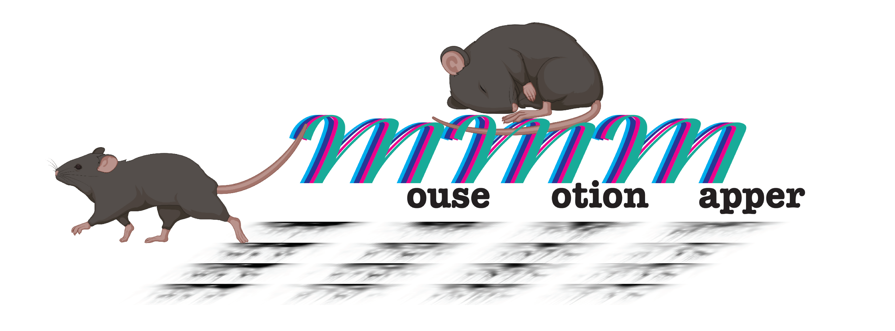
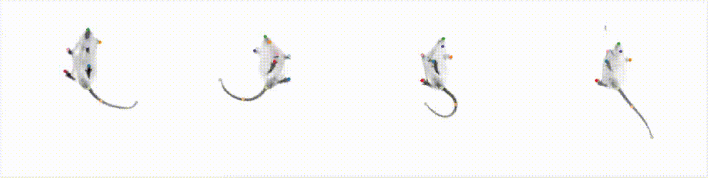
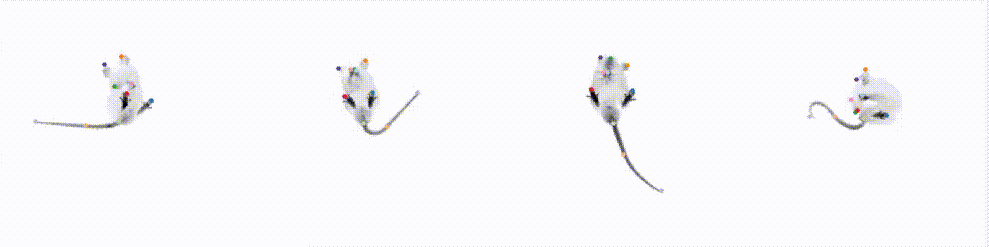
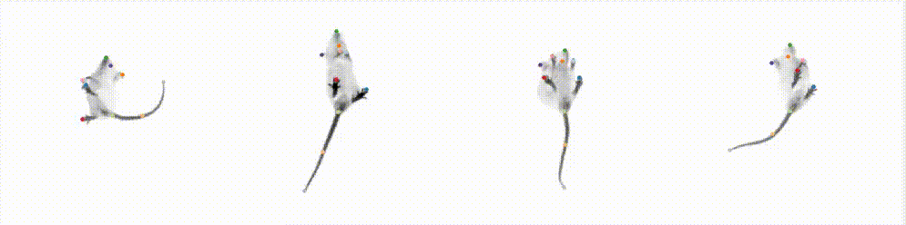
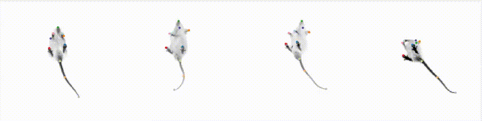
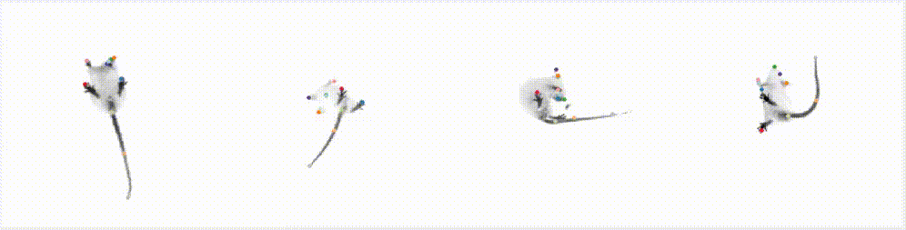
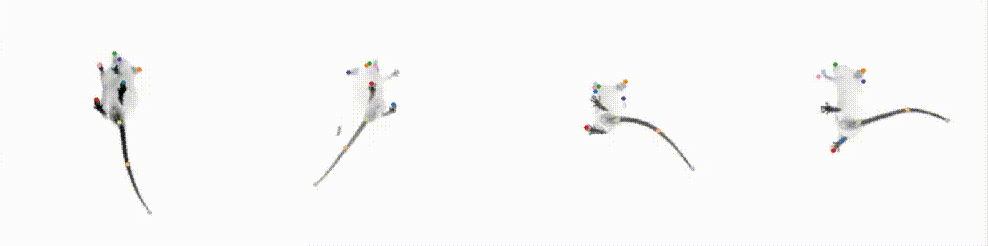
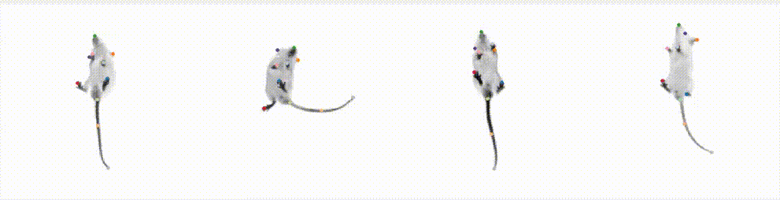
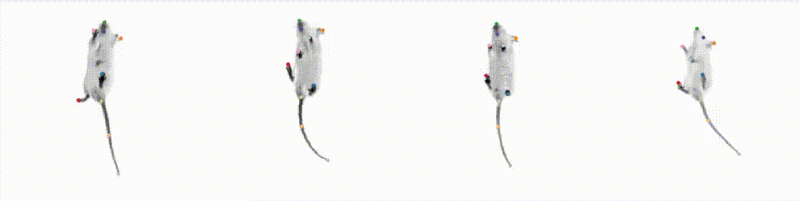
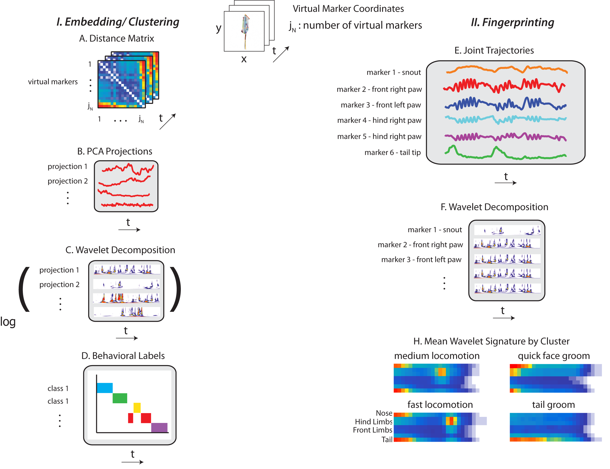

# Deep behavioral phenotyping of mouse autism models using open-field behavior.
Ugne Klibaite, Mikhail Kislin, Jessica L. Verpeut, Xiaoting Sun, Joshua W. Shaevitz, Samuel S.-H. Wang.
Molecular Autism 13, 12 (2022). https://doi.org/10.1186/s13229-022-00492-8
https://molecularautism.biomedcentral.com/articles/10.1186/s13229-022-00492-8
This repository contains the analysis code for the above manuscript. 

------------


### MouseMotionMapper


a unique semi-supervised behavioral classification and behavioral labeling pipeline. 
The framework makes use of deep neural network, PCA, Morlet Wavelet, t-SNE, and k-Mean clustering to define behavior classes. 
Recent advances in body part tracking [Pereira et al. (2019)](https://doi.org/10.1038/s41592-018-0234-5) allow to extimate a mouse pose. Here, we adapted behavioral mapping from [Berman et al. (2014)](https://doi.org/10.1098/rsif.2014.0672) for use with the body part position time series.
 
Sample snippets from each behavioral class generated from movies:

IDLE


GROOMING


SLOW EXPLORE


FAST EXPLORE


REAR


CLIMBING


AMBLE/STEP/TURN


LOCOMOTION


## Features and methods included

- [x] Tracking and alignment code for local and cluster
- [x] 2 and 18 body part LEAP models
- [x] Embedding/Clustering code
- [x] Training data + Principal component coefficients 
- [x] Code for Fingerprinting
- [x] Code for Embedding new data to behavior space
- [x] Analysis/figure generation code
- [ ] Documentation
- [x] Examples of usage


### Installation

Git clone the web URL (example below) or download ZIP. It works in Matlab 2019b and above - please submit issues if it's not working. The Image Processing Toolbox, Signal Processing toolbox and the Parallel Processing Toolbox are required.

Change your current working directory to the location where you want the cloned directory to be made.
```bash
git clone https://github.com/PrincetonUniversity/MouseMotionMapper
```
All MATLAB external toolboxes are included in the MouseMotionMapper/utilities subfolder. Just add the subdirectory to the MATLAB Search Path to access all functionality:
addpath(genpath('utilities'))

### data and meta data
Download the raw data from dataspace.princeton.edu (https://doi.org/10.34770/bzkz-j672)


### Usage
The best way to start is by looking at the various demos.

#### Step 1: Embedding/Clustering

#### Step 2: Embedding new data to behavior space

#### Step 3: Fingerprinting



#### Resources
https://github.com/talmo/leap

https://github.com/gordonberman/MotionMapper


### License
This package is licensed under the MIT License. If you use our algorithm and/or model/data, please cite us! Preprint/peer-review will be announced above.

#### References
1. Gordon J Berman, Daniel M Choi, William Bialek, and Joshua W Shaevitz. Mapping the stereotyped behaviourof freely moving fruit flies.Journal of The Royal Society Interface, 11(99):20140672, 2014.
2. Talmo D Pereira, Diego E Aldarondo, Lindsay Willmore, Mikhail Kislin, Samuel S-H Wang, Mala Murthy, andJoshua W Shaevitz. Fast animal pose estimation using deep neural networks.Nature methods, 16(1):117, 2019.

